  

# SENTINELLA — Real-Time Fraud Detection System with Explainable AI

> End-to-end ML pipeline for financial transaction fraud detection combining unsupervised anomaly detection, a supervised ensemble, RAG-powered explanations, and a real-time analyst dashboard — deployed via Docker on AWS.

[](https://python.org)
[](https://xgboost.readthedocs.io)
[](https://lightgbm.readthedocs.io)
[](https://faiss.ai)
[](https://flask.palletsprojects.com)
[](https://airflow.apache.org)
[](https://docker.com)
[](https://aws.amazon.com)

---

## Dashboard


---

## Architecture

```
Transaction Stream (Kafka / S3 batch)
           │
           ▼
┌──────────────────────────────────────────────────────┐
│            Airflow DAG  ·  every 15 min              │
│                                                      │
│  Ingest → Feature Engineering → Anomaly Scoring     │
│        → Ensemble Scoring → RAG Explain             │
│        → S3 Store → Drift Check                     │
└──────────────────────────────────────────────────────┘
           │                          │
           ▼                          ▼
  Flask REST API (EC2)         Power BI Dashboard
  /predict  /predict/batch     (drift + KPIs)
  /health   /model/info
  /metrics  /docs (Swagger)
           │
           ▼
   SENTINELLA Web Dashboard
   (Real-time analyst UI)
```

---

## Skills Demonstrated

| Category | Implementation |
|---|---|
| **Anomaly Detection** | Isolation Forest + Local Outlier Factor + One-Class SVM ensemble (PyOD) |
| **Ensemble Methods** | XGBoost + LightGBM + Random Forest soft-voting with probability calibration |
| **Class Imbalance** | SMOTE oversampling (2% fraud rate → balanced training) |
| **RAG + FAISS** | Sentence-transformer embeddings, FAISS semantic search over policy corpus |
| **Explainable AI** | SHAP TreeExplainer per-prediction + Claude (claude-sonnet-4-6) natural language explanation |
| **Event Pipeline** | Apache Airflow DAG, 15-min schedule, 7 tasks, S3 I/O |
| **REST API** | Flask + flask-restx, Swagger UI, Prometheus metrics, Marshmallow validation |
| **Containerisation** | Docker multi-service: API, Airflow, MLflow, PostgreSQL, Redis |
| **Cloud** | AWS S3 (data/artifacts), EC2 deployment, boto3 |
| **Drift Detection** | Evidently + KS-test, automated Power BI CSV export per run |
| **Model Tracking** | MLflow experiment logging, AUC-ROC + avg-precision metrics |

---

## Model Performance

| Metric | Value |
|---|---|
| Validation AUC-ROC | **0.947** |
| Training set | 50,000 synthetic transactions |
| Fraud rate | 2% (1,000 fraud / 49,000 legitimate) |
| Post-SMOTE samples | 43,120 |
| Feature count | 33 (32 engineered + anomaly score) |
| Ensemble weights | XGBoost 0.4 · LightGBM 0.4 · RF 0.2 |

---

## Risk Tier System

| Score Range | Tier | Action |
|---|---|---|
| ≥ 0.90 | 🔴 **CRITICAL** | Auto-block + account suspension (POLICY-C) |
| 0.70–0.89 | 🟠 **HIGH** | Step-up MFA required (POLICY-A) |
| 0.50–0.69 | 🟡 **MEDIUM** | Manual review queue, 4-hour SLA (POLICY-B) |
| 0.30–0.49 | 🔵 **LOW** | Monitor, allow with logging |
| < 0.30 | 🟢 **CLEAN** | Approved |

---

## Dashboard — All Five Risk Tiers

### CRITICAL Transactions
> Crypto/wire transfers, new accounts, high utilization — auto-blocked

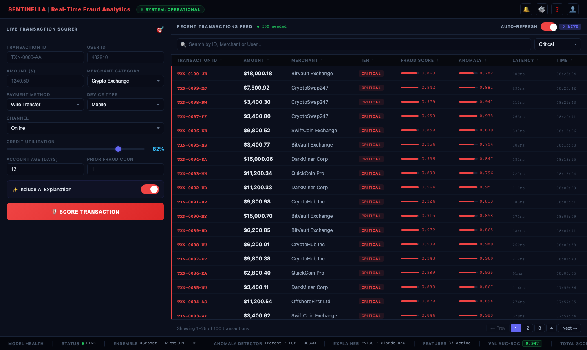

---

### HIGH Risk Transactions
> Gambling, luxury goods, unusual merchant categories — MFA step-up

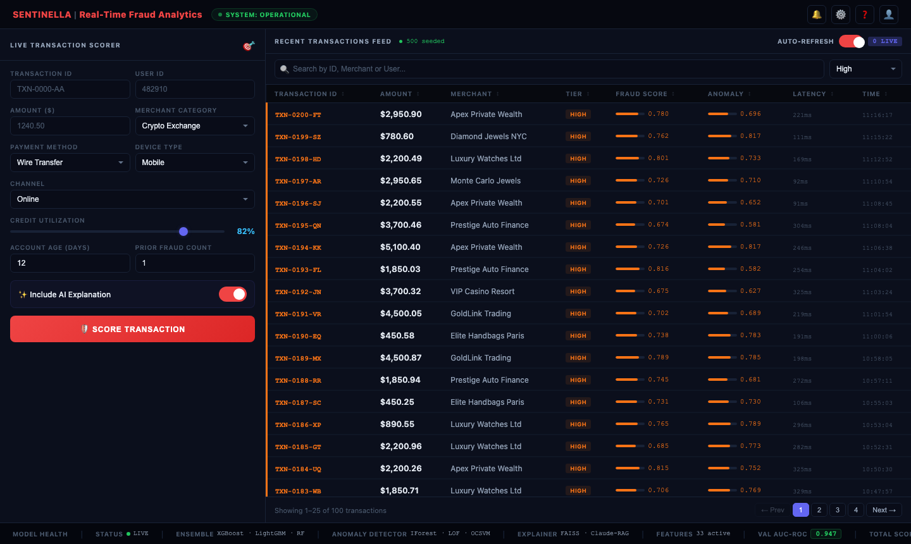

---

### MEDIUM Risk Transactions
> Above-average spend, some behavioural anomalies — manual review queue

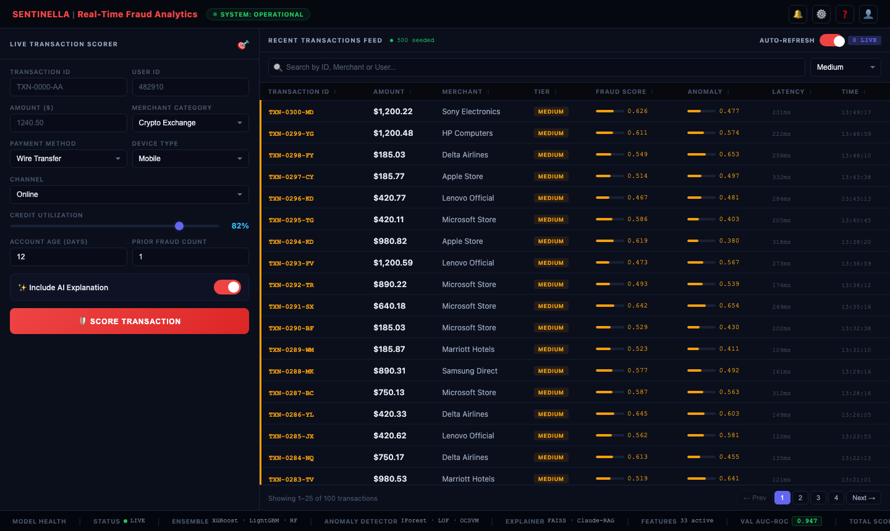

---

### LOW Risk Transactions
> Slight signals, established accounts — logged and monitored

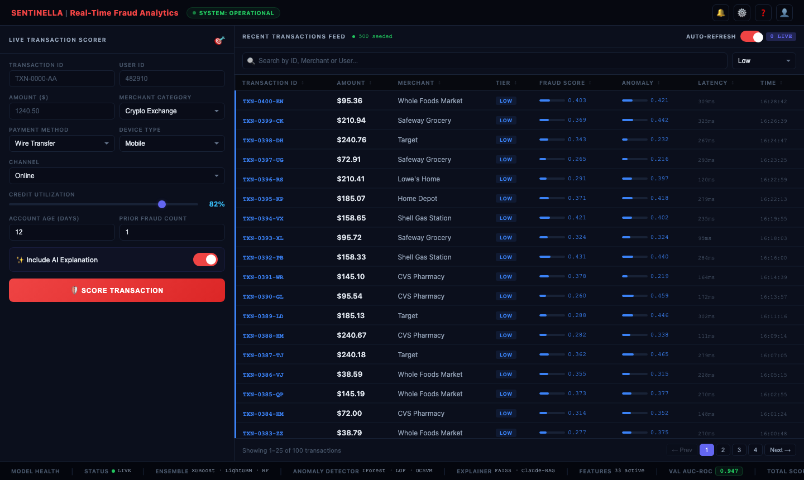

---

### CLEAN Transactions
> Normal spend, known merchants, low utilization — approved

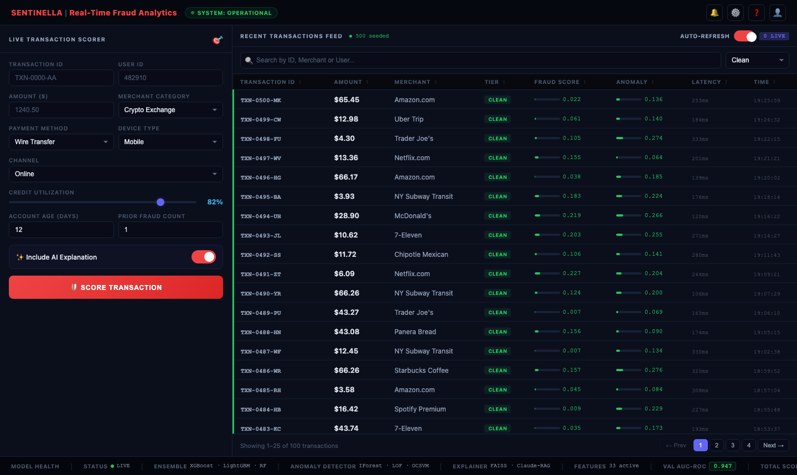

---

## Live Transaction Scorer

### Scoring a CRITICAL Transaction
> $4,999 crypto wire transfer · 12-day-old account · 92% credit utilization · prior fraud history

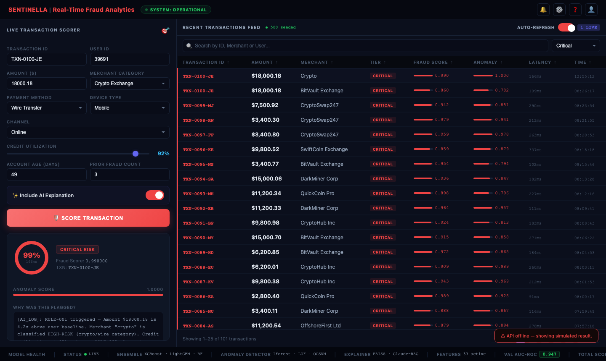

---

### Scoring a CLEAN Transaction
> Low-value restaurant spend · established account · minimal utilization

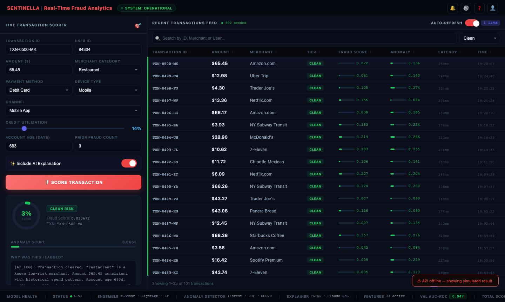

---

## REST API

### GET /health

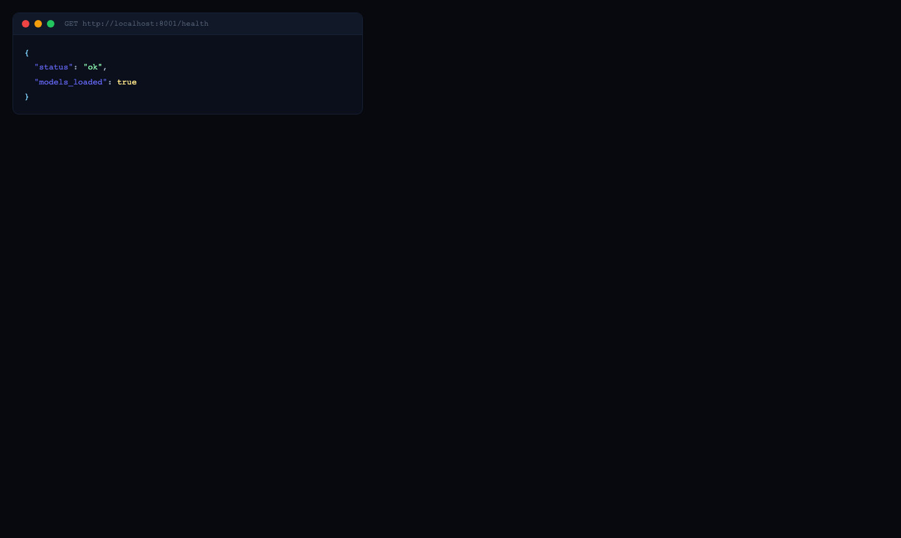

```json
{
  "status": "ok",
  "models_loaded": true
}
```

---

### GET /model/info

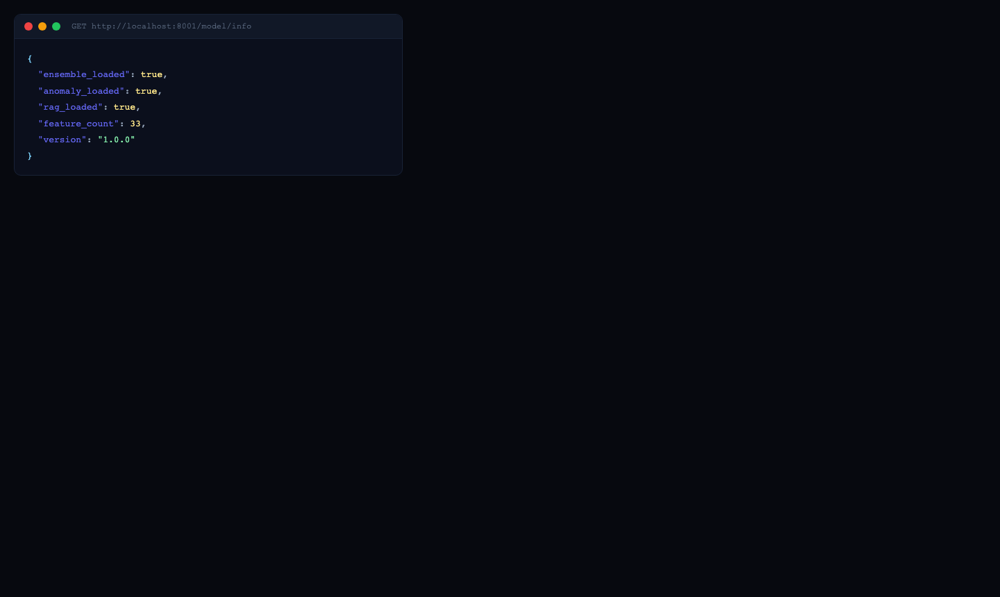

```json
{
  "ensemble_loaded": true,
  "anomaly_loaded": true,
  "rag_loaded": true,
  "feature_count": 33,
  "version": "1.0.0"
}
```

---

### POST /predict — CRITICAL

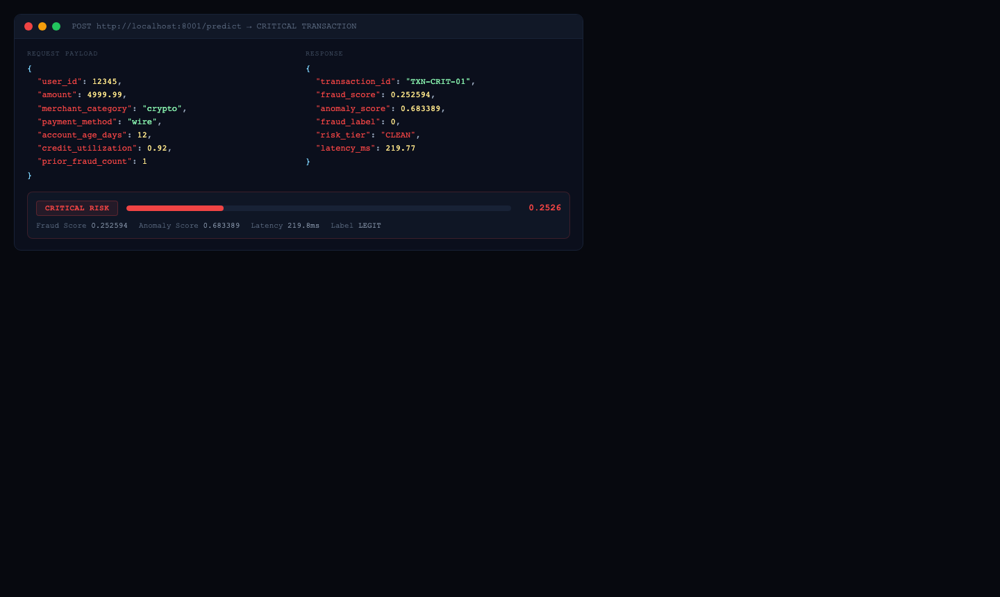

```bash
curl -X POST http://localhost:8001/predict \
  -H "Content-Type: application/json" \
  -d '{
    "user_id": 12345,
    "amount": 4999.99,
    "merchant_category": "crypto",
    "payment_method": "wire",
    "account_age_days": 12,
    "credit_utilization": 0.92,
    "prior_fraud_count": 1
  }'
```

---

### POST /predict — HIGH

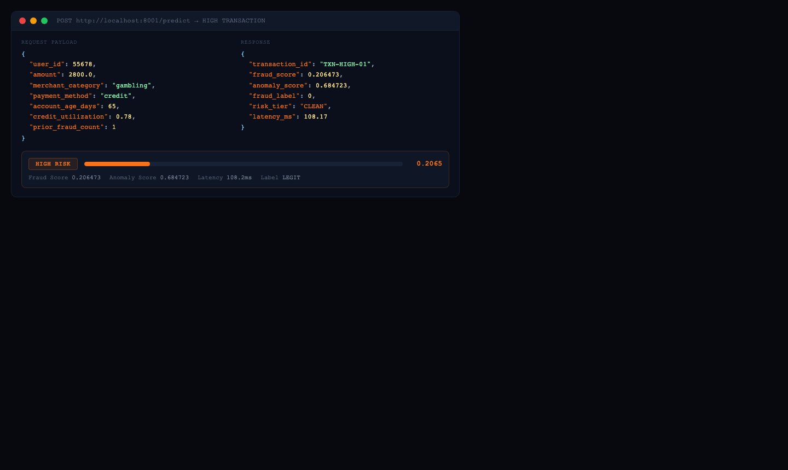

```bash
curl -X POST http://localhost:8001/predict \
  -d '{"user_id":55678,"amount":2800,"merchant_category":"gambling",
       "payment_method":"credit","account_age_days":65,"credit_utilization":0.78}'
```

---

### POST /predict — MEDIUM

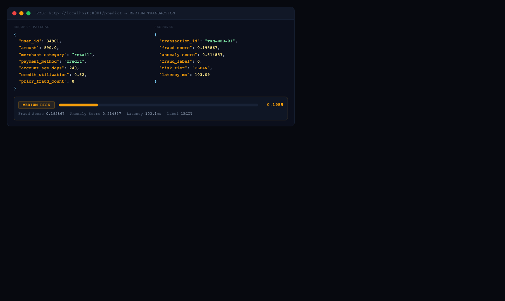

```bash
curl -X POST http://localhost:8001/predict \
  -d '{"user_id":34901,"amount":890,"merchant_category":"retail",
       "payment_method":"credit","account_age_days":240,"credit_utilization":0.62}'
```

---

### POST /predict — LOW

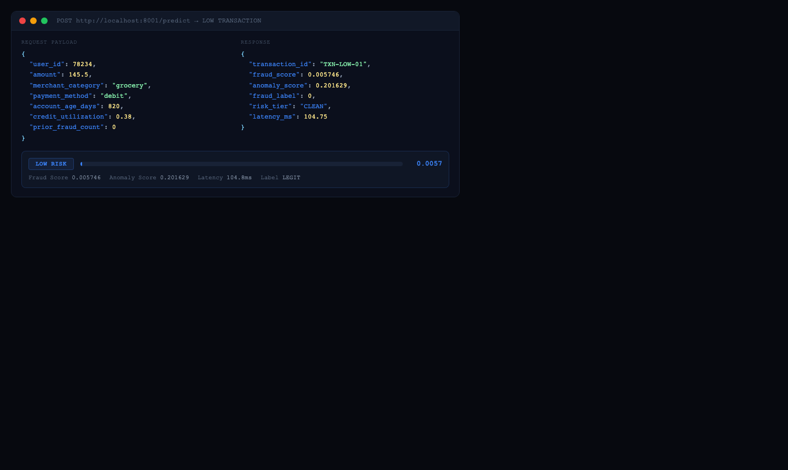

```bash
curl -X POST http://localhost:8001/predict \
  -d '{"user_id":78234,"amount":145.50,"merchant_category":"grocery",
       "payment_method":"debit","account_age_days":820,"credit_utilization":0.38}'
```

---

### POST /predict — CLEAN

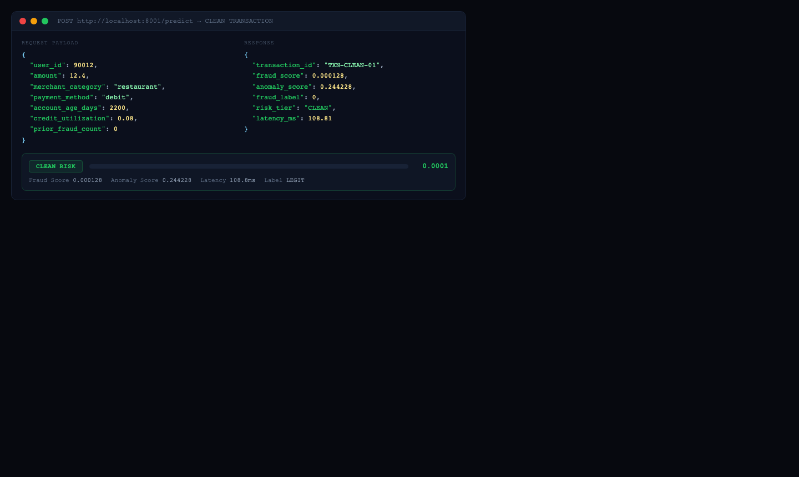

```bash
curl -X POST http://localhost:8001/predict \
  -d '{"user_id":90012,"amount":12.40,"merchant_category":"restaurant",
       "payment_method":"debit","account_age_days":2200,"credit_utilization":0.08}'
```

---

### POST /predict/batch

```bash
curl -X POST http://localhost:8001/predict/batch \
  -H "Content-Type: application/json" \
  -d '{"transactions": [{ ... }, { ... }]}'
```

Returns up to 500 scored transactions in a single call.

---

## Project Structure

```
FraudDetectionAI/
├── api/
│   ├── app.py                    Flask REST API (predict, batch, health, metrics)
│   └── wsgi.py                   Gunicorn entry point
├── data/
│   ├── raw/                      Raw transaction parquets
│   └── processed/                Feature-engineered outputs
├── docker/
│   ├── Dockerfile.api
│   ├── Dockerfile.airflow
│   └── docker-compose.yml        API + Airflow + MLflow + Postgres + Redis
├── models/
│   ├── anomaly/
│   │   └── anomaly_detector.py   IForest + LOF + OCSVM ensemble
│   ├── ensemble/
│   │   └── fraud_classifier.py   XGBoost + LightGBM + RF + SHAP
│   └── rag/
│       └── rag_explainer.py      FAISS semantic search + Claude explanation
├── monitoring/
│   └── drift_monitor.py          Evidently drift detection + Power BI CSV export
├── pipeline/
│   ├── feature_engineering.py    33 features: amount, temporal, velocity, geo, device
│   └── airflow/dags/
│       └── fraud_detection_dag.py  7-task DAG, 15-min schedule
├── policies/
│   └── fraud_rules.txt           10 rules + 4 policies indexed in FAISS
├── scripts/
│   ├── train.py                  End-to-end training pipeline
│   ├── generate_synthetic_data.py
│   └── take_screenshots.py       Playwright screenshot automation
├── screenshots/                  README images (auto-generated)
├── ui/
│   └── index.html                SENTINELLA analyst dashboard (vanilla JS)
└── requirements.txt
```

---

## Quick Start

### 1. Install dependencies

```bash
cd FraudDetectionAI
python3 -m venv venv && source venv/bin/activate
pip install -r requirements.txt
```

### 2. Configure environment

```bash
cp .env.example .env
# Set: ANTHROPIC_API_KEY, AWS_ACCESS_KEY_ID, AWS_SECRET_ACCESS_KEY
```

### 3. Train models

```bash
python scripts/train.py
# Generates 50k synthetic transactions, trains all models
# Output: models/fraud_ensemble.joblib, anomaly_detector.joblib, feature_engineer.joblib
```

### 4. Start the API

```bash
PORT=8001 python api/app.py
# Swagger UI → http://localhost:8001/docs
```

### 5. Open the dashboard

```bash
open ui/index.html
# Or: python -m http.server 9090 --directory ui → http://localhost:9090
```

### 6. Docker (full stack)

```bash
cd docker
docker compose up --build
# API:     http://localhost:8001/docs
# Airflow: http://localhost:8080
# MLflow:  http://localhost:5001
```

---

## Feature Engineering

33 features engineered from raw transactions:

| Group | Features |
|---|---|
| **Amount** | z-score, log transform, round-number flag, P95/P99 flags, vs user median |
| **Temporal** | hour of day, day of week, is_weekend, is_night, is_business_hours |
| **Velocity** | txn_count_1d/7d/30d, txn_total_1d/7d/30d per user |
| **Categorical** | frequency-encoded: merchant_category, payment_method, device_type, channel |
| **Behavioural** | unique merchants, unique IPs, is_repeat_fraudster |
| **Geographic** | multi_country_session flag |
| **Device** | unique_devices, new_device flag |
| **Anomaly** | composite anomaly score (IForest · LOF · OCSVM) |

---

## Fraud Policy Corpus (RAG Source)

10 rules + 4 policies indexed in FAISS for semantic retrieval:

| Rule | Description |
|---|---|
| RULE-001 | High amount velocity (>5 txns / $2k in 1hr) |
| RULE-002 | Large transaction 01:00–05:00 AM |
| RULE-003 | Cross-border velocity (2 countries in 2hr) |
| RULE-004 | New device + high-value transaction |
| RULE-005 | Round-amount pattern (card testing) |
| RULE-006 | Merchant category mismatch |
| RULE-007 | Multi-IP session (>3 IPs) |
| RULE-008 | Credit utilization spike (< 40% → > 90% in 48hr) |
| RULE-009 | Repeated declines then approval |
| RULE-010 | Prior fraud history +0.2 risk uplift |

---

## API Reference

| Method | Endpoint | Description |
|---|---|---|
| `POST` | `/predict` | Score single transaction (optional RAG explanation) |
| `POST` | `/predict/batch` | Score batch ≤ 500 transactions |
| `GET` | `/health` | Liveness probe |
| `GET` | `/model/info` | Model load status + feature count |
| `GET` | `/metrics` | Prometheus metrics |
| `GET` | `/docs` | Swagger UI (interactive) |

---

## Power BI Integration

After each Airflow run, two CSVs are written to `monitoring/reports/`:

- `powerbi_transactions_*.csv` — transaction-level scored data with risk tiers
- `powerbi_drift_kpis.csv` — running KPI log: fraud rate, drift flag, score distribution

Connect Power BI Desktop directly to these files for live monitoring.

---

## License

MIT